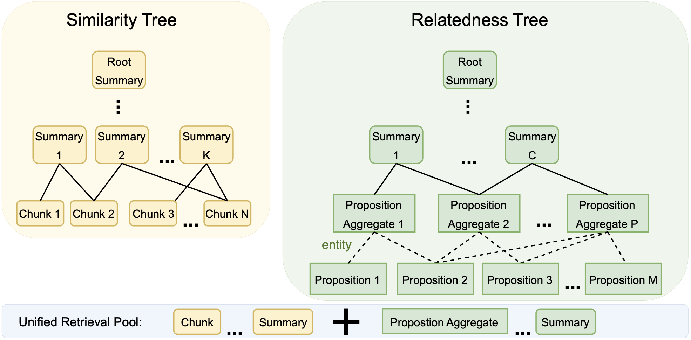

# SiReRAG
Code for ICLR 2025 paper [SiReRAG: Indexing Similar and Related Information for Multihop Reasoning](https://arxiv.org/abs/2412.06206).

Navigation:
[Overview](#overview), 
[Datasets](#datasets),
[Proposition and Entity Extraction](#prop-and-entity-extraction),
[Running SiReRAG](#running-sirerag),
[Citation](#citation)


## Overview
We introduce **SiReRAG**, an innovative RAG indexing approach that considers both similarity and relatedness. Unlike existing methods of solely modeling similarity or relatedness, SiReRAG delivers a consistent improvement over state-of-the-art indexing baselines (e.g., GraphRAG and RAPTOR) across several multihop QA benchmarks. The figure below displays SiReRAG tree. The left tree of SiReRAG integrates information based on similarity (the semantic similarity of text pieces) while its right tree integrates information based on relatedness (the degree of connection of texts based on signals such as entities and propositions). All tree nodes are placed into a unified retrieval pool.




## Datasets
Using the same corpus and evaluation metrics as [HippoRAG](https://github.com/OSU-NLP-Group/HippoRAG), we mainly conduct our experiments on MuSiQue, 2Wiki, and HotpotQA benchmarks. We have included these datasets here. Specifically, file names ending with `_corpus.json` represent the dataset files we build our indexing trees on. After indexing, we perform evaluation on `musique.json`, `2wikimultihopqa.json`, and `hotpotqa.json`.


## Proposition and Entity Extraction
We specify the details of extracting propositions and their entities in our methodology section. LLM prompts (in Section 4.2) for getting propositions and entities from 10K documents of BAAI/IndustryCorpus to fine-tune a smaller model are specified in our Appendix. We also release the extraction outputs of our fine-tuned Mistral model here (file names ending with `_kg.json`). We used these extraction outputs to build SiReRAG trees.

Moreover, without fine-tuning, we obtained similar multihop performace by directly prompting `GPT-4o`  with the same prompts used for extraction to get propositions and their entities on the evaluation benchmarks. Our extraction methodology in Section 4.2 is a cost-efficient approach when you want to train a small model for various different datasets.


## Running SiReRAG
First of all, download necessary packages:

    pip install llama-index
    llamaindex-cli download-llamapack RaptorPack --download-dir ./raptor_pack
    pip install llama-index-vector-stores-chroma
    pip install datasets

Replace `base.py` of `raptor_pack/llama_index/packs/raptor/` folder with the provided `base.py` in this repository. Our `base.py` contains our modeling of relatedness, which is the novelty of our work.

Then, run `SiReRAG_musique.ipynb`, `SiReRAG_2wiki.ipynb`, and `SiReRAG_hotpot.ipynb` to start our RAG pipelines and get the QA outputs. Remember to provide your OpenAI API in these files. Final QA outputs will be saved in the `output/` folder.

For evaluation, run:

    python evaluate_musique.py     # For evaluation on MuSiQue
    python evaluate_2wiki.py       # For evaluation on both 2Wiki and HotpotQA

## Citation
```bibtex
@inproceedings{
zhang2025sirerag,
title={SiRe{RAG}: Indexing Similar and Related Information for Multihop Reasoning},
author={Nan Zhang and Prafulla Kumar Choubey and Alexander Fabbri and Gabriel Bernadett-Shapiro and Rui Zhang and Prasenjit Mitra and Caiming Xiong and Chien-Sheng Wu},
booktitle={The Thirteenth International Conference on Learning Representations},
year={2025},
url={https://openreview.net/forum?id=yp95goUAT1}
}
```
